# Equity Direction Prediction under Multiple-Testing Controls

A reproducible Python research system for testing whether short-horizon equity
direction signals survive leakage controls, realistic execution assumptions,
out-of-sample validation, and multiple-testing corrections.

> This project is not presented as a profitable trading strategy. It is a
> research system designed to test whether apparent short-horizon equity signals
> survive leakage controls, realistic execution assumptions, out-of-sample
> validation, and multiple-testing corrections.

## Main Result

Across five archived flagship runs that can be re-audited from their local
machine-readable summaries, **no strategy–symbol test row significantly beat its
target-majority baseline after Benjamini–Hochberg false-discovery-rate control**.
This negative result is the research conclusion, not a failed attempt to market
a trading strategy.

Some rows reject a 50% win-rate null, but those rejections are not evidence of
alpha: a long-biased classifier can pass that null in a rising market. The
drift-aware gate requires both rejection against the observed majority-class
rate and performance above that rate. The verified flagship audit reports zero
passes under that stricter rule.

| Verified result | Evidence |
|---|---|
| Final drift-aware passes | 0 across each of five archived flagship runs |
| Long-history intraday OOS predictions | 6,450,316 aggregated test predictions |
| Intraday cost survival | 60/112 strategy–symbol rows at 0 bps; 0/112 at 1 bps and above |
| Unit tests | 80 before restructuring; 86 after restructuring |

Sources and important scope qualifications are in
[`docs/results.md`](docs/results.md). In particular, the historical reports'
“0/442” v1–v4 count is disclosed but not promoted as an independently
reconstructed number because the repository has no single experiment manifest
that recreates exactly those 442 rows.

## Overview

The repository began as a next-bar direction study on large U.S. equities. It
evolved into quantitative research infrastructure for falsifying apparent
signals. The system compares baselines, technical rules, statistical-learning
models, intraday rules, cross-sectional ranking, and meta-labeling under
time-aware validation and execution constraints.

The stable implementation remains in the existing importable root packages
(`backtest`, `core`, `data`, `features`, `metrics`, `reports`, and
`strategies`). Moving them mechanically into `src/` would create unnecessary
compatibility risk. `main.py` remains the full-data CLI; the public synthetic
entry point is `scripts/run_experiment.py`.

## Research Question

Do short-horizon directional signals in a point-in-time large-cap U.S. equity
universe retain predictive and economic value when evaluated:

- strictly out of sample;
- with feature, label, and universe lookahead controls;
- at a later executable price;
- after transaction costs;
- against both a 50% null and the observed majority-class rate; and
- after correction for repeated hypothesis testing?

Prediction accuracy, statistical significance, and economic profitability are
separate questions here. Passing one does not imply passing the others.

## Why This Project Exists

Backtests can manufacture persuasive results through future-aware features,
random splits, survivorship bias, threshold selection on the test set,
overlapping labels, optimistic execution, omitted costs, or selective reporting
across many trials. This project makes those failure modes testable and records
negative findings instead of hiding them.

Its principal deliverable is therefore a falsification workflow: a candidate
must survive increasingly realistic controls before it can be treated as
evidence. No tested candidate met the final standard.

## Research Pipeline

```mermaid
flowchart LR
    A["Raw data"] --> B["Point-in-time preprocessing"]
    B --> C["Feature construction"]
    C --> D["Purged train / validation / test"]
    D --> E["Model or rule fitting"]
    E --> F["Next-bar-open execution"]
    F --> G["Transaction-cost adjustment"]
    G --> H["Out-of-sample metrics"]
    H --> I["Multiple-testing correction"]
    I --> J["Robustness analysis"]
    J --> K["Research conclusion"]
```



## Leakage and Bias Controls

- Technical features use observations available at or before the signal bar.
- Labels and executable returns are constructed separately from features.
- External macro, options-index, and short-interest features use explicit
  `available_from` dates and backward-only as-of joins.
- Per-symbol external features are keyed by ticker to prevent cross-symbol
  contamination.
- Point-in-time membership can mask observations before a company enters the
  historical universe.
- Purge and embargo gaps separate training and test observations.
- Thresholds and feature selection are fitted inside training data.
- Tests cover tail-truncation lookahead canaries, label alignment, split
  boundaries, release lag, and symbol isolation.

See [`docs/methodology.md`](docs/methodology.md) and
[`docs/validation.md`](docs/validation.md).

## Validation Design

The default design is expanding walk-forward validation. A CPCV mode is also
implemented, but CPCV fold rows reuse observations across paths; the reporting
code explicitly invalidates overlap-sensitive compounded returns and
single-sample inference for those rows.

Triple-barrier experiments enlarge purge and embargo widths to cover the entry
lag plus maximum holding period. Overlapping labels are summarized with
uniqueness weights and effective sample sizes, and a separate sequential
single-position simulation avoids invalidly compounding overlapping trades.

## Statistical Testing

The reporting layer includes:

- Wilson intervals and two-sided binomial tests;
- a 50% direction null for historical comparability;
- a target-majority null for drift-aware evaluation;
- Benjamini–Hochberg FDR-adjusted p-values;
- Deflated Sharpe Ratio as a diagnostic for trial multiplicity; and
- uniqueness- and effective-sample-size-aware inference for overlapping labels.

The headline boolean is `beats_majority_after_fdr`, not
`significant_after_fdr`. A two-sided majority-null rejection can describe a
strategy that is significantly worse than the majority baseline; the headline
gate additionally requires the tested win rate to be higher.

No standalone pass threshold for the Deflated Sharpe Ratio is encoded, so this
repository does not invent a DSR “pass count.”

## Execution and Cost Assumptions

For the binary next-bar experiments, a signal at bar *t* is evaluated using the
next bar's open as entry and that bar's close as exit. The default round-trip
cost is 5 basis points. Intraday configurations can instead combine spread and
slippage assumptions and apply time-of-day multipliers.

These are bar-based approximations, not a market simulator. Queue position,
partial fills, latency, bid–ask dynamics, and market impact are not modeled.
The project has no broker connection and no live-trading validation.

## Experiment Families

- Baselines: always-up, training-majority, seeded random, and buy-and-hold-like
  direction exposure.
- Technical rules: moving-average crossover and RSI/Bollinger mean reversion.
- Models: logistic regression, random forest, and gradient boosting.
- Intraday rules: opening-range breakout, VWAP mean reversion, and momentum
  continuation.
- Extensions: cross-sectional momentum ranking and a second-stage
  meta-labeling filter.
- External features: selected FRED series, CBOE SKEW, and FINRA short interest,
  each behind an explicit configuration gate.

These families are hypotheses under evaluation, not endorsed strategies.

## Repository Structure

```text
.
├── backtest/                 # splitters, thresholds, execution accounting
├── configs/                  # historical configs and public example config
├── core/                     # configuration and PIT universe
├── data/                     # loaders; local caches are ignored
├── docs/                     # public methodology and release documentation
├── features/                 # backward-looking features and labels
├── metrics/                  # classification, return, and trial statistics
├── reports/                  # report builders and small public audit tables
├── scripts/                  # synthetic run, tests, result audit, security scan
├── strategies/               # baselines, rules, ML, intraday, meta
├── tests/                    # deterministic unit and integration tests
├── main.py                   # full-data research CLI
└── pyproject.toml            # packaging and dependency groups
```

Historical output directories, raw/cache data, virtual environments, generated
HTML, and internal work logs are intentionally excluded by `.gitignore`. They
have not been deleted from the local research workspace.

## Quick Start

Python 3.11 or later is required.

```bash
python3 -m venv .venv
source .venv/bin/activate
python -m pip install -e ".[dev]"
python -m unittest discover -s tests
python scripts/run_experiment.py --config configs/example_config.yaml
```

On Windows, activate with `.venv\Scripts\activate` before running the same
Python commands.

The example command uses a deterministic fictional OHLCV sample. It does not
download data and does not reproduce the historical research result.

## Reproducing the Results

There are three distinct levels of reproduction:

1. **Unit tests** — `python -m unittest discover -s tests`
2. **Synthetic smoke run** —
   `python scripts/run_experiment.py --config configs/example_config.yaml`
3. **Historical research runs** — `python main.py --config <historical-config>
   --offline`, after legally obtained data have been placed in the configured
   local cache

For example:

```bash
python main.py --config configs/config.pit_top10.yaml --offline
python main.py --config configs/config.intraday_long.yaml --offline --intraday
```

Full historical reproduction is data- and compute-intensive. The raw data and
multi-gigabyte prediction artifacts are not distributed. The small public
result audit can be regenerated in the original local workspace with:

```bash
python scripts/build_public_summary.py
```

See [`reports/README.md`](reports/README.md) for source paths and provenance.

## Data Policy

No proprietary or license-restricted raw market data should be committed. Local
bar data, external-series caches, and vendor downloads belong under ignored
`data/cache*`, `data/raw`, `data/private`, or `data/vendor` paths.

The repository includes only a deterministic fictional sample for interface and
smoke testing. Users must supply their own legally obtained data for historical
reproduction. See [`data/README.md`](data/README.md).

## Tests

The suite uses Python's standard `unittest` framework and requires no private
data or network access:

```bash
./scripts/run_tests.sh
```

Coverage includes feature lookahead, target/execution alignment, purge and
embargo boundaries, out-of-sample generation, transaction-cost accounting,
seed reproducibility, BH-FDR reference cases, CPCV masking, effective sample
size, point-in-time membership, publication lag, cross-symbol isolation, and an
end-to-end synthetic pipeline.

## Limitations

This is a historical bar-level backtest on a limited equity universe. It does
not model live execution, impact, full order-book dynamics, or all possible
market regimes. Data-vendor adjustments and availability are external
dependencies. Multiple-testing procedures have assumptions of their own, and
the experiment inventory is not a preregistered universe of every hypothesis
that could have been tried.

The archived v1–v4 “442 combinations” count is repeated in research reports but
cannot be independently reconstructed from a single manifest. The public
documentation therefore treats it as a historical reported count rather than a
fully audited denominator. See [`docs/limitations.md`](docs/limitations.md).

## Negative Results and Interpretation

The project found many ways for apparent signals to disappear:

- fixed thresholds weakened under nested selection;
- overlapping-label performance shrank under sequential simulation and
  effective-sample-size correction;
- present-day-universe backfills inflated drift results;
- macro and SKEW clusters failed ablation or cost stress;
- short-interest features did not improve the final decision; and
- long-history 5-minute strategies failed even a 1 bp cost threshold.

“No candidate survived” is not proof that no equity signal can exist. It means
the candidates, data, periods, and controls represented here do not justify an
alpha claim.

## AI-Assisted Development Disclosure

Existing project records show that AI assistance was used during implementation,
refactoring, review, and test development. Research questions, statistical
controls, experiment interpretation, and final claims still require human
verification. Tests and review reduce risk but do not establish correctness by
themselves. Details are in [`docs/ai_assistance.md`](docs/ai_assistance.md).

## Disclaimer

This repository is for research and education only. It is not investment,
legal, tax, or financial advice; it is not an offer to trade; and it is not a
production trading system. Historical and synthetic results do not predict
future performance.

## Citation

Citation metadata are provided in [`CITATION.cff`](CITATION.cff). If you build
on the repository, cite the software and describe the exact configuration,
data provenance, and evaluation period used.
